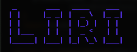
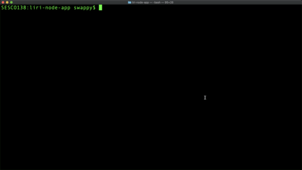
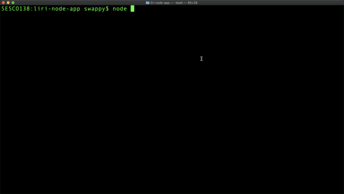

#   
## Language Interpretation and Recognition Interface

----
Author: Swaroop Kondreddy

Feel free to use some or all of this code if you're trying to complete a similar project.

----
### Project Overview
LIRI is like iPhone's SIRI. However, while SIRI is a Speech Interpretation and Recognition Interface, LIRI is a Language Interpretation and Recognition Interface.
##### v1 (liri.js)
A command line Node app that takes in parameters and returns data from the following APIs: Bandsintown, Spotify and OMDb.

##### v2 (interactiveLiri.js)
A user interactive Node app that allows users to enter the values based on the option chosen for Spotify, Movie or Concert.

----
### How it works (v1)
Type into the command line....

- ```node liri.js concert-this "artist/band name here"``` to return concert information from Bandsintown. 

- ```node liri.js spotify-this-song "song name here"``` to return song information from Spotify. If no song is entered, a hard coded default song will return.
  
- ```node liri.js movie-this "movie name here"``` to return movie information from OMDb. If no movie is entered, a hard coded default movie will return.
  
- ```node liri.js do-what-it-says``` to return information stored in random.txt

----

### Technology and Packages used

[Node.js](https://nodejs.org/en/)

[chalk](https://www.npmjs.com/package/chalk)

[figlet](https://www.npmjs.com/package/figlet)

[fs](https://www.npmjs.com/package/fs)

[axios](https://www.npmjs.com/package/axios)

[CLUI](https://www.npmjs.com/package/clui)

[clear](https://www.npmjs.com/package/clear) - v2 only

[moment](https://www.npmjs.com/package/moment)

[Bandsintown API](http://www.artists.bandsintown.com/bandsintown-api)

[OMDb API](http://www.omdbapi.com/)

[Spotify API](https://developer.spotify.com/documentation/web-api/)

----

### Executing the Project

1. Register for API keys from [Bandsintown API](http://www.artists.bandsintown.com/bandsintown-api), [OMDb API](http://www.omdbapi.com/), [Spotify API](https://developer.spotify.com/documentation/web-api/).
2. Once you have the keys [clone](https://github.com/swaroopreddyk/liri-node-app.git) this project.
3. Create a .env file and have the following entries  
    * SPOTIFY_ID="<--YOUR_KEY_HERE-->"
    * SPOTIFY_SECRET="<--YOUR_KEY_HERE-->"
    * OMDB_API="<--YOUR_KEY_HERE-->"
    * BANDS_API="<--YOUR_KEY_HERE-->"
4. Then run the following command to install the requied node packages  
`npm install`
5. Look at the below GIF's on the execution details
    * v1 (liri.js)  
    
    

    * v2 (interactiveLIRI.js)

      
